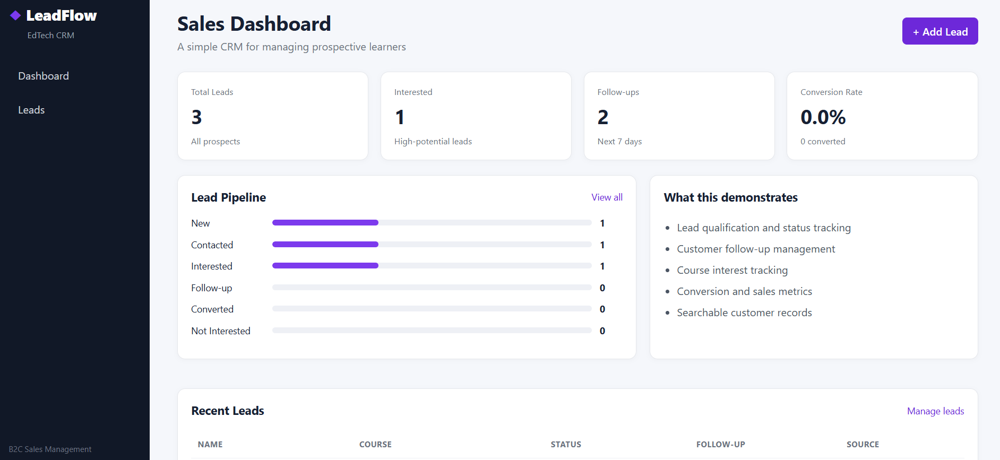
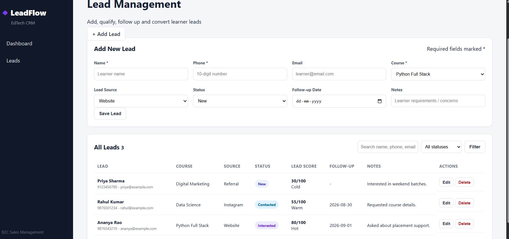

# LeadFlow – EdTech Lead Management CRM

LeadFlow is a beginner-friendly **B2C Sales CRM** designed for EdTech businesses to manage prospective learners, track follow-ups, qualify leads, and monitor sales performance.

## 🚀 Features

- 📊 Sales dashboard
- 👥 Lead management
- ➕ Add new leads
- ✏️ Edit existing leads
- 🗑️ Delete leads
- 🔎 Search leads by name, phone, or email
- 🎯 Filter leads by status
- 📈 Lead scoring system
- 📅 Follow-up date tracking
- 📚 Course interest tracking
- 📌 Lead source tracking
- 🔄 Lead status management
- 📊 Sales conversion rate
- 💾 SQLite database
- 📱 Responsive web interface

## 🖥️ Screenshots

### Sales Dashboard



### Lead Management



## 🛠️ Tech Stack

- Python
- Flask
- SQLite
- HTML5
- CSS3
- Jinja2

## 📂 Project Structure

```text
edtech-lead-crm/
│
├── app.py
├── crm.db
├── requirements.txt
├── README.md
│
├── static/
│   └── style.css
│
└── templates/
    ├── base.html
    ├── dashboard.html
    └── leads.html